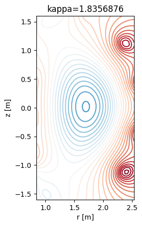

# A demostration of the FDP capabilities
In this repository, an example of a typical use of the Fusion Data Platform (FDP) is shown. In this demostration the goal is to create a model that predicts the values of plasma elongation given a cross section of the flux surfaces in DIII-D.

We are providing a Jupyter Notebook `fdp-demonstration.py` that will guide you on all the process. There are fours steps:
- Data extraction using TokSearch.
- (Optional) Data analysis.
- Model training.
- Model testing.

The `parameters.json` file is used to set the (hyper-)parameters for all the workflow.

This exemple has been executed on Expanse (SDSC) although any computer would be OK. 

**TO DO** list:
- CMF integration

## Building the environment
We use a Conda environment for this demo. The requirements are specified in `environment.yml` file. The versions of the tested packages have been added but the only hard requiste is `Python<3.12` due `CMF`. It will install [TokSearch](https://github.com/GA-FDP/toksearch_d3d), [CMF](https://hewlettpackard.github.io/cmf/) and other commons packages in AI/ML.

To install that environment simply do:

```bash
conda env create -f environment.yml
``` 

## FDP demostration

The `fdp-demonstration.ipynb` will guide you through all of this but here we are summarizing the sections in the Notebook. Alternatively you can execute use `run.sh` from bash to run the whole demo.

### Create your own dataset with Toksearch

The script `src/dataset_gen.py` uses Toksearch to pull the DIII-D database and save the elongation (*kappa*) and flux surface cross section (*psirz*) from roughly 1000 shots. Each shot contains different number of time slices which leads to a total number of points of 200k+.

To run the script, within the Conda environment, one can do:
```bash
fdp run python dataset_gen.py
```

The script uses `pipeline` and `MdsSignal` to access the DIII-D dataset. The data is then fetched into an `xarray` Dataset for each shot. *Kappa* is stored in a 1D array where each value correspond to a time slice. Meanwhile *psi* is a 2D array of the *psi* values in a cross section.

The following image shows the data from an arbitraty shot and time



 
The Datasets from each shot are combined into a larger one that it is finally saved on a two netCDF files for training and testing.

### Model training

In `src/train.py`, a regression model is used to predict plasma elongation (*kappa*) from flux surface using the dataset described above. 

A simple convolutional neural network (CNN) is built with Pytorch for this regressions task. With `MLflow`, some metrics such as loss are saved to track model performance.

The script will output the model weights in a a figure with the training and validation losses.

### Model testing

In `src/test.py` the model
